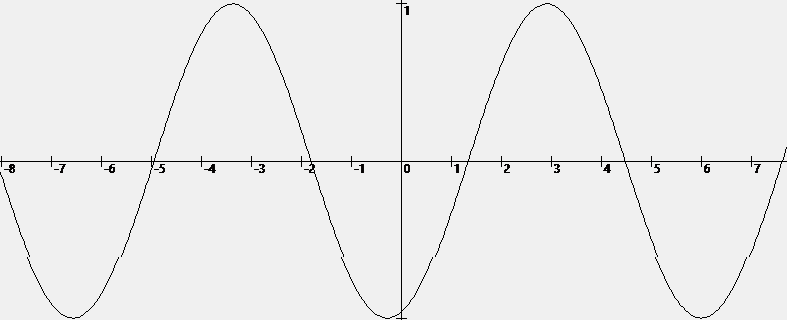

A moving function in Windows Forms (.NET 5). Project was created in Visual Studio 2019.

1) Drawing any function using lines: (x, f(x)) - (x + s, f(x + s))
```csharp
void DrawF(Graphics g, Func<double, double> f, double XSCALE, double YSCALE, double xShift)
{
  double XCENTER = this.Width / 2;
  double YCENTER = this.Height / 2;
  double XSIZE = this.Width;

  double xStart = -XCENTER / XSCALE - xShift;
  double xEnd = (XSIZE - XCENTER) / XSCALE;
  double XSTEP = .05;

  double x1 = xStart;
  double y1 = -f(x1);
  Pen pen = new Pen(Brushes.Black, 1);
  for (double x = xStart + XSTEP; x < xEnd + XSTEP; x += XSTEP)
  {
    double y = -f(x);
    g.DrawLine(pen, (int)((x1 + xShift) * XSCALE + XCENTER), (int)(y1 * YSCALE + YCENTER), 
      (int)((x + xShift) * XSCALE + XCENTER), (int)(y * YSCALE + YCENTER));
    x1 = x;
    y1 = y;
  }
}
```

2) Animate loop: infinite loop right
```csharp
for (double shift = 0; ; shift += .05)
{
  DrawF(g, Math.Sin, 100, 100 * Math.PI, shift);
}
```

[Full code](Form1.cs)
